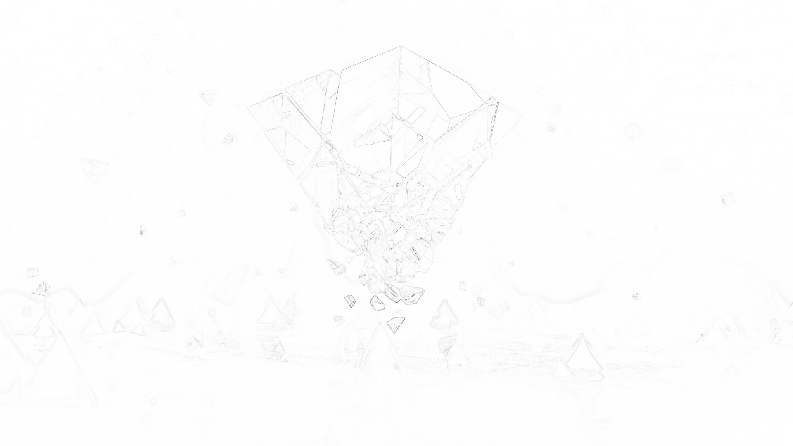
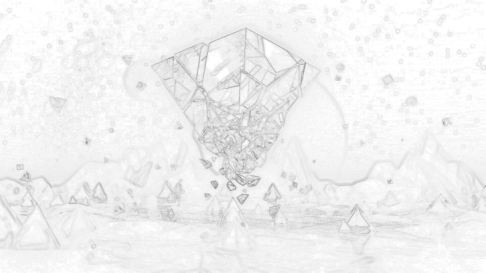

# Image Outline
This is a little thought experiment for generating the outline of an image.

## Algorithm
Pixels create light, and more or less light based on the colour of the pixel. This is called luminosity and it will be the basis of the outlining algorithm. It will go from 0 to 1 where 0 is black, and 1 is white.

I was originally just placing fully black pixels where the was *enough* of a difference in luminosities. The rational behind that was that the edge of an object usually only looks like that because there is a strong contrast between the two objects. This however, led to some extremely jagged and error-prone results (ie. not all edges would be "found").

The next idea was to just draw all of the pixels of the original image, but using the difference in luminosities to create a gray colour. This led to the "earlier generation" image. You can't actually see the image very clearly here. This led to the final and current iteration.

Instead of using the raw 0 to 1 difference in luminosity, I first square root that value before generating the gray pixel colour. This will push all of the values upwards towards 1, but still below it.

## Rust Speedup
This was first written in Python, but it would take more than 10 seconds for a complete run.

```
Loaded image (1920x1080): 0s 361ms 34μs 200ns
Done with the luminance map: 4s 995ms 639μs 900ns
25% Done: 6s 526ms 585μs 100ns
50% Done: 8s 105ms 352μs 900ns
75% Done: 9s 657ms 177μs 600ns
Done: 11s 233ms 988μs 200ns
Done saving: 11s 847ms 349μs 700ns
```

I then wanted to write it in Rust to see just how much faster it could be. With just a direct conversion, the time got pushed down to nearly a quarter of a second. Most of that time is decoding then encoding the image.

```
Loaded image (1920x1080): 0s 98ms 515μs 200ns
Done with the luminance map: 0s 120ms 75μs 93ns
25% Done: 0s 127ms 278μs 80ns
50% Done: 0s 135ms 434μs 666ns
75% Done: 0s 141ms 747μs 200ns
All Done: 0s 148ms 393μs 386ns
Done saving: 0s 274ms 333μs 866ns
```

## Running
If you want to run this project yourself, you can clone the repo and run the Python or Rust version.

The Python version requires a version of Pillow (so we can use PIL).

The Rust version will fetch and build its dependencies when you run it with `cargo run --release`. The release flag will be important for actually doing speed comparisons.

## Comparisons
### Original


### Earlier Generation


### Normal Outline

